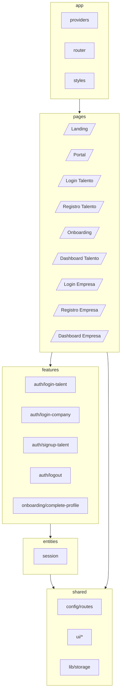
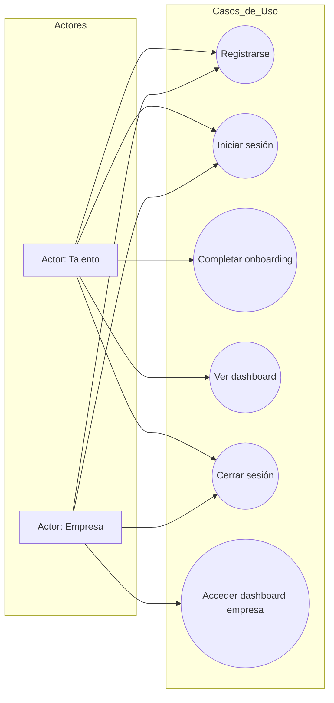
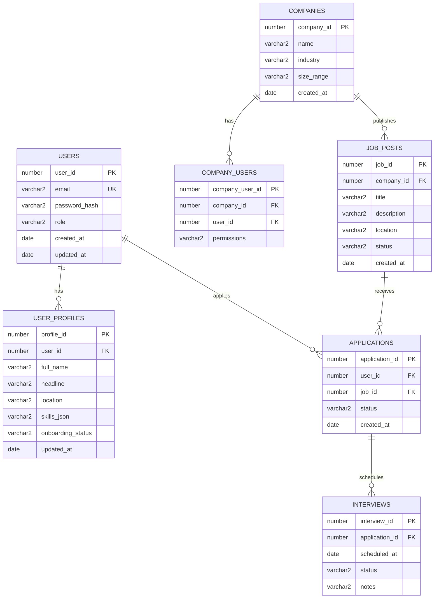
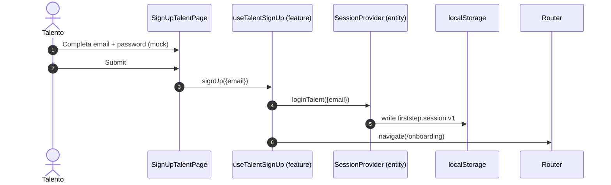
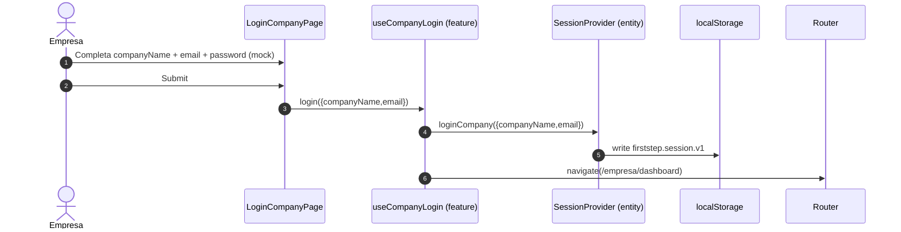
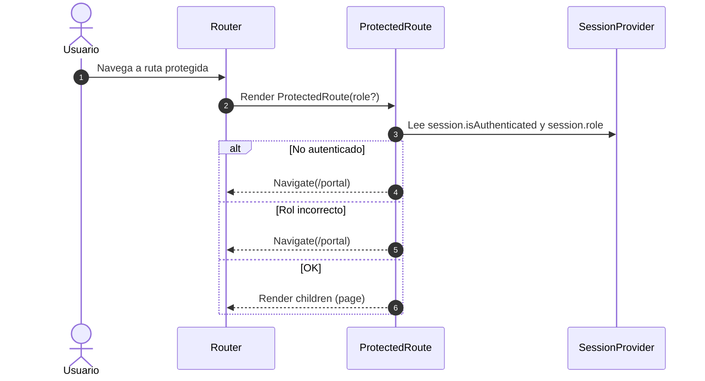

# Diagramas (Mermaid)

Este documento contiene diagramas técnicos y funcionales relevantes para el proyecto. Los diagramas están escritos en Mermaid para facilitar su versionado.

## 1) Arquitectura del sistema (alto nivel)

```mermaid
flowchart LR
  U[Usuario] -->|HTTP| FE[Frontend\nReact + Vite + TS + Tailwind]

  FE -->|Futuro| API[Backend API\nNode.js + Express + TS]
  API -->|Futuro| DB[(Oracle Database)]

  subgraph Frontend
    FE --> R[Router]
    FE --> UI[UI Kit\nshared/ui]
    FE --> S[Session (mock)\nlocalStorage]
  end
```

## 2) Arquitectura del frontend (FSD)



## 3) Diagrama de flujo — Acceso desde Landing

```mermaid
flowchart TD
  A[Landing (/)] --> B{Tipo de usuario}
  B -->|Talento| C{Acción}
  B -->|Empresa| D{Acción}

  C -->|Login| C1[/Login Talento (/login)/]
  C -->|Registro| C2[/Registro Talento (/talento/registro)/]

  D -->|Login| D1[/Login Empresa (/empresa/login)/]
  D -->|Registro| D2[/Registro Empresa (/empresa/registro)/]
```

## 4) Diagrama de flujo — Talento (Registro/Login → Onboarding → Dashboard)

```mermaid
flowchart TD
  T0{Talento} --> T1[/Registro Talento/]
  T0 --> T2[/Login Talento/]

  T1 --> T3[Session.loginTalent\n(persistir localStorage)]
  T2 --> T3

  T3 --> T4{onboardingCompleted?}
  T4 -->|No| T5[/Onboarding/]
  T4 -->|Sí| T6[/Dashboard Talento/]
  T5 --> T7[Session.completeOnboarding]
  T7 --> T6
```

## 5) Diagrama de flujo — Empresa (Login/Registro → Dashboard Empresa)

```mermaid
flowchart TD
  E0{Empresa} --> E1[/Login Empresa/]
  E0 --> E2[/Registro Empresa/]

  E1 --> E3[Session.loginCompany\n(persistir localStorage)]
  E2 --> E3

  E3 --> E4[/Dashboard Empresa/]
```

## 6) Casos de uso (actores y funcionalidades)



## 7) Modelo de datos (ERD propuesto — Oracle)

Este diagrama es una propuesta para cuando se implemente backend/BD.



## 8) Diagramas de secuencia — Flujos críticos

### 8.1) Registro talento → sesión → onboarding



### 8.2) Login empresa → sesión → dashboard empresa



### 8.3) Acceso a ruta protegida


